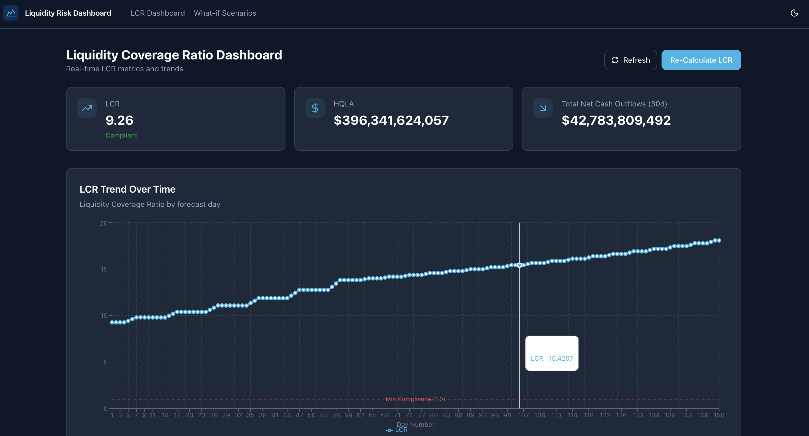
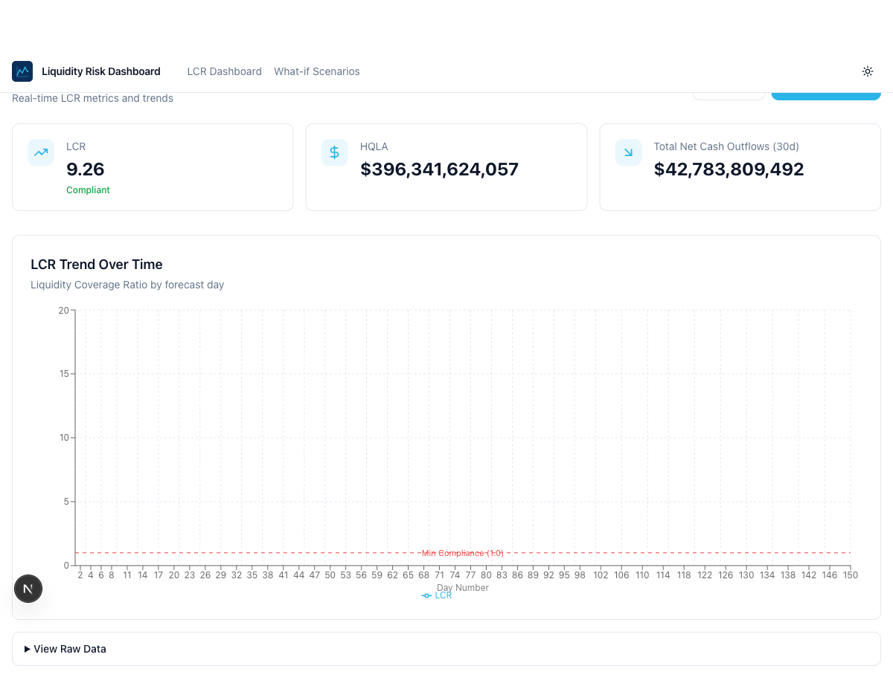

# Liquidity Risk Agent - Snowflake Guide

## Overview

This Snowflake Guide demonstrates how to build a Liquidity Coverage Ratio (LCR) analysis solution using Snowflake. It includes:

- **LCR Dashboard**: Real-time metrics and trend visualization
- **What-If Scenarios**: Run pre-defined scenarios to analyze impact on LCR
- **AI-Powered Agent**: Natural language queries via Cortex Analyst semantic view




## Step-By-Step Guide

For prerequisites, environment setup, and instructions, refer to the [QuickStart Guide](https://www.snowflake.com/en/developers/guides/liquidity-risk-agent/).

## Manual Deployment Steps

### Step 1: Run Setup Script (Sections 1-9)

Open `scripts/setup.sql` in Snowflake and run **Sections 1 through 9**:
- Section 1: Role Setup
- Section 2: Warehouse Setup
- Section 3: Database & Schemas Setup
- Section 4: Stages Setup
- Section 5: Raw Schema Tables
- Section 6: Load Reference Data
- Section 7: Generate Sample Data
- Section 8: RAW_SANDBOX Schema (Sandbox Tables)
- Section 9: Presentation Schema Tables

### Step 2: Upload Files to Stages

Upload the local files to their respective Snowflake stages:

**Notebooks** → `LIQUIDITY_RISK_DB.NOTEBOOKS.LIQUIDITY_NOTEBOOK_STAGE`:
- `notebooks/LIQUIDITY_FORECAST.ipynb`
- `notebooks/LIQUIDITY_WHAT_IF_FORECAST_SANDBOX.ipynb`
- `notebooks/prod_calculations.py`
- `notebooks/utils.py`
- `notebooks/environment.yml`

**Streamlit** → `LIQUIDITY_RISK_DB.STREAMLIT.LIQUIDITY_STREAMLIT_STAGE`:
- `streamlit/app.py`
- `streamlit/environment.yml`

You can use SnowSQL, Snowsight's data upload, or the PUT commands in Section 10 of `setup.sql`.

### Step 3: Complete Setup (Sections 11-13)

Run **Sections 11 through 13** of `setup.sql`:
- Section 11: Create Notebooks from Stage
- Section 12: Create Streamlit App from Stage
- Section 13: Semantic View & Agent Setup

### Step 4: Run the Demo

You can run the dashboard using either **Streamlit in Snowflake** or the **Snowflake App (Next.js)**.

#### Option A: Streamlit in Snowflake

1. **Open the Streamlit App** (`LIQUIDITY_STREAMLIT`) in Snowsight
2. **Generate LCR Data**: Click "Re-Calculate LCR" to run the LIQUIDITY_FORECAST notebook
3. **Run What-If Scenarios**: Use the "What-if Scenarios" page to analyze different scenarios
4. **Ask the Agent**: Use the "Ask the Agent" page, or go to **Snowflake Intelligence** to chat with the agent directly

#### Option B: Snowflake App (Next.js on SPCS)

The `liquidity-risk-app/` directory contains a full-stack Next.js app that can be deployed to Snowflake via Snowpark Container Services.



**Prerequisites**: [Snowflake CLI](https://docs.snowflake.com/en/developer-guide/snowflake-cli/index) (`snow`) installed and configured.

**Local development**:
```bash
cd liquidity-risk-app
npm install
npm run dev
# Open http://localhost:3000
```

> Note: For local dev, ensure your `~/.snowflake/connections.toml` has a valid connection. Set `SNOWFLAKE_CONNECTION_NAME=<your_connection>` in `.env.local` if needed.

**Deploy to Snowflake**:
```bash
cd liquidity-risk-app
snow app deploy --connection <your_connection>
```

The app will be built and deployed on SPCS. Once complete, you'll receive a `.snowflakecomputing.app` URL.

**Pages**:
- **/** — LCR Dashboard (metrics, trend chart, re-calculate button)
- **/what-if** — What-if Scenario Analysis (select and execute pre-defined scenarios)

## Example Questions for the Agent

Try asking the agent these questions to explore the liquidity data:

**LCR Analysis**
- "What is the current LCR and how does it trend over 30 days?"
- "On which days does the LCR fall below 100%?"
- "Show me the LCR forecast for the next 90 days"

**HQLA (High Quality Liquid Assets)**
- "What is the total HQLA value by asset classification?"
- "Which business unit has the highest HQLA holdings?"
- "Break down HQLA by Level 1, Level 2A, and Level 2B assets"

**Cash Flows**
- "What are the largest cash outflows by counterparty?"
- "Compare total inflows vs outflows over the forecast period"
- "Which business units have the highest net cash outflows?"

**What-If Scenarios**
- "Compare the baseline LCR to what-if scenario results"
- "How does the stress scenario impact LCR on day 30?"
- "Show me all what-if scenario definitions"

**Positions & Holdings**
- "What positions do we hold in government bonds?"
- "List the top 10 positions by USD value"
- "What is our exposure by security type?"

## Structure

```
liquidity-risk-agent/
├── LICENSE
├── README.md
├── notebooks/
│   ├── LIQUIDITY_FORECAST.ipynb
│   ├── LIQUIDITY_WHAT_IF_FORECAST_SANDBOX.ipynb
│   ├── EVALUATE_SEMANTIC_VIEW.ipynb
│   ├── prod_calculations.py
│   ├── utils.py
│   └── environment.yml
├── streamlit/
│   ├── app.py
│   └── environment.yml
├── liquidity-risk-app/          # Snowflake App (Next.js)
│   ├── app/                     # Pages and API routes
│   ├── components/              # React components
│   ├── lib/                     # Snowflake SDK helper, constants
│   ├── snowflake.yml            # Deployment config
│   ├── app.yml                  # App metadata
│   └── package.json
└── scripts/
    └── setup.sql
```

## Variables

| Variable | Value |
|----------|-------|
| PREFIX | LIQUIDITY_RISK |
| DATABASE | LIQUIDITY_RISK_DB |
| WAREHOUSE | LIQUIDITY_RISK_WH |
| ROLE | LIQUIDITY_RISK_ROLE |
